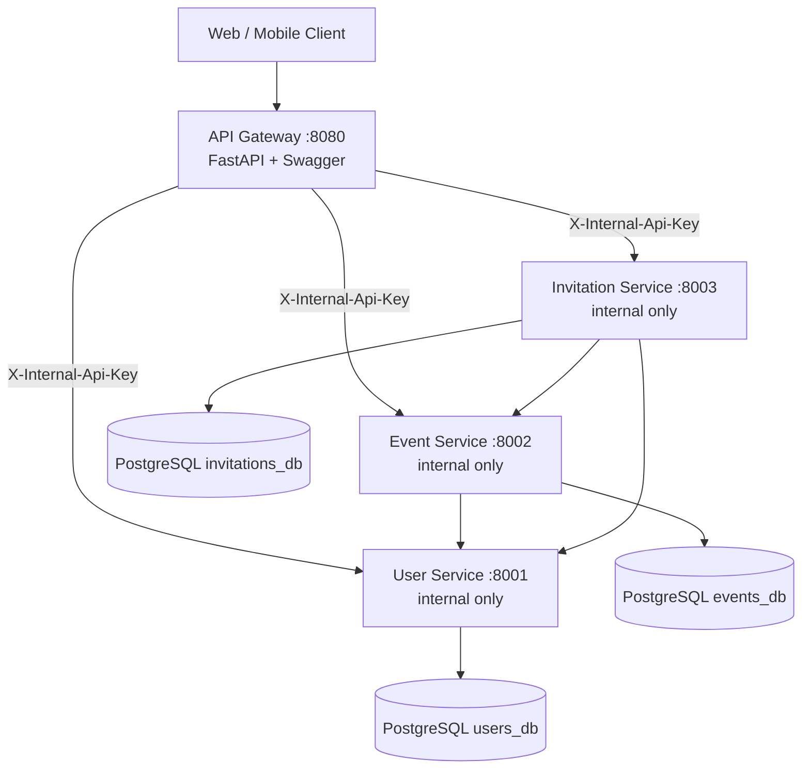

# Event Scheduling System — Architecture & Design

**Author:** Rajendra Badgujar | Tech Lead Python  
**Assessment:** In-app System Design + Production Implementation

---

## 1. High-Level Architecture



| Component | Responsibility |
|-----------|----------------|
| **API Gateway** | Single public entry point, unified OpenAPI/Swagger, orchestrates calls to private services |
| **User Service** | User CRUD (organizers & invitees) |
| **Event Service** | Events, recurrence expansion, occurrence exceptions, series splits |
| **Invitation Service** | Invitations & RSVP status (accept / reject / tentative) |

**Security model:** Microservices listen only on the Docker internal network (`expose`, not `ports`). Direct access is blocked by `X-Internal-Api-Key` validation on every internal route.

---

## 2. Database Design

### User Service (`users_db`)

| Table | Key columns |
|-------|-------------|
| `users` | `id`, `email` (unique), `full_name`, timestamps |

### Event Service (`events_db`)

| Table | Purpose |
|-------|---------|
| `event_series` | Master event / recurring series (title, times, timezone, organizer, participants JSON, recurrence_rule JSON, `series_end_time` for split series) |
| `occurrence_overrides` | Per-occurrence edits (single-instance exceptions) |
| `deleted_occurrences` | Cancelled instances within a series |

**Design choice:** Store recurrence as JSON (RFC 5545–inspired) and expand occurrences at read time using `python-dateutil.rrule`. Overrides and deletions are layered on expanded instances.

### Invitation Service (`invitations_db`)

| Table | Key columns |
|-------|-------------|
| `invitations` | `event_series_id`, `invitee_id`, optional `occurrence_start` (NULL = whole series), `status` enum |

Unique constraint: `(event_series_id, invitee_id, occurrence_start)` prevents duplicate invites.

---

## 3. Recurring Event Handling Strategy

### Master + Exceptions (iCalendar-style)

1. **Create series** — One `event_series` row holds recurrence rule:
   - Daily / weekly / monthly / yearly
   - `interval` (e.g. every 2 weeks)
   - `by_weekday` (e.g. `["MO"]` → every Monday)
   - `by_monthday` (e.g. `[15]` → monthly on the 15th)
   - `until` or `count` end conditions

2. **Expand on read** — For a `[range_start, range_end)` query, generate occurrences via `rrule`, then apply:
   - `deleted_occurrences` → skip
   - `occurrence_overrides` → merge field-level changes
   - `series_end_time` → stop generating past split point

3. **Modification scopes**

| Scope | Behavior |
|-------|----------|
| **single** | Upsert `occurrence_overrides` for `original_start` |
| **future** | Set `series_end_time` on old series; create new `event_series` from occurrence forward (optionally new recurrence) |
| **all** | PATCH master `event_series` |

4. **Delete scopes**

| Scope | Behavior |
|-------|----------|
| **single** | Insert `deleted_occurrences` |
| **future** | Set `series_end_time` before occurrence |
| **all** | `is_cancelled = true` on series |

### Examples

- **Every Monday 10 AM:** `{ "frequency": "weekly", "by_weekday": ["MO"] }`
- **Every 2 weeks:** `{ "frequency": "weekly", "interval": 2 }`
- **Monthly on 15th:** `{ "frequency": "monthly", "by_monthday": [15] }`

---

## 4. API Design Approach

- **Versioned public API:** `/api/v1/...` on the gateway only
- **Resource-oriented:** `users`, `events`, `invitations`
- **Occurrence sub-resource:** `/events/{series_id}/occurrences` with `scope` in body for edits/deletes
- **List with filters:** `range_start`, `range_end`, `user_id` for calendar views
- **Idempotent-friendly:** Unique constraints on users (email) and invitations

**Swagger:** http://localhost:8080/docs

---

## 5. Scalability Considerations

| Area | Approach |
|------|----------|
| **Horizontal scaling** | Stateless FastAPI services behind a load balancer; gateway scales independently |
| **Database** | Database-per-service; no shared schema coupling |
| **Read-heavy calendar** | Cache expanded occurrences in Redis (key: `series_id:range`); invalidate on write |
| **Recurrence expansion** | Cap at 500 occurrences per query; paginate large ranges |
| **Async I/O** | SQLAlchemy async + `httpx` for inter-service calls |
| **Future** | Kafka/RabbitMQ for invitation notifications; read replicas per DB; CQRS for heavy listing |

---

## 6. Edge Cases & Tradeoffs

| Edge case | Handling | Tradeoff |
|-----------|----------|----------|
| DST / timezone shifts | Store `timezone` on series; expand in UTC | Full TZ-aware expansion needs `zoneinfo` per occurrence (future enhancement) |
| Edit single then edit all | Overrides remain until series updated | May need “clear overrides” on `ALL` edit |
| Very long infinite recurrence | `count` / `until` limits; max 500 per request | Prevents unbounded CPU on read |
| Split series (FUTURE edit) | `parent_series_id` links lineage | Listing must walk related series for complete history |
| Participant on one occurrence | `occurrence_overrides.participant_ids` | Invitations for single occurrence use `occurrence_start` |
| Concurrent edits | Last-write-wins | Production: optimistic locking (`version` column) |
| Gateway vs service schema drift | Gateway defines public DTOs; maps to services | Duplication vs single shared package (monorepo `shared/` optional) |

**Read-time expansion vs materialized occurrences**

- ✅ Less storage, simpler writes, natural exception model  
- ❌ Higher CPU per list query → mitigate with caching/materialization for hot series

---

## 7. Repository Layout

```
services/
  api-gateway/      # Public :8080
  user-service/       # Internal :8001
  event-service/      # Internal :8002
  invitation-service/ # Internal :8003
docker-compose.yml
ARCHITECTURE.md
README.md
```
